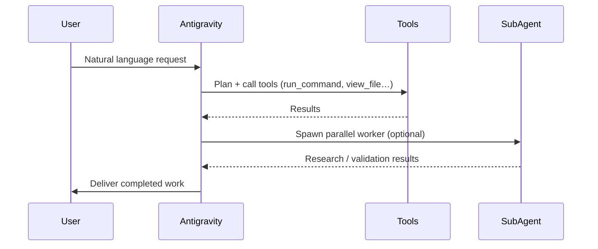

[← Back to Home](../index.md)

# 💡 About Google Antigravity

**Google Antigravity** is an AI-first agentic coding assistant built by Google DeepMind. It goes far beyond code completion — it acts as an autonomous pair programmer that can plan, execute, debug, and ship software end-to-end.

---

## 🤖 What Makes It Different

| Traditional AI Assistants | Google Antigravity |
|---|---|
| Suggest code snippets | Write, run, and fix code autonomously |
| Answer questions | Execute multi-step plans with tools |
| Work in a single turn | Maintain long-running agentic sessions |
| Static context | Spawn parallel sub-agents for research |
| No system access | SSH into remote machines, run builds |

---

## ⚙️ Core Capabilities

### 1. Agentic Tool Use
Antigravity has access to a rich set of tools it can call autonomously:
- **`run_command`** — Execute shell commands, builds, tests
- **`view_file` / `replace_file_content`** — Read and edit any file
- **`grep_search` / `find_by_name`** — Navigate codebases
- **`search_web`** — Look up documentation in real time
- **`invoke_subagent`** — Spawn parallel worker agents

### 2. Subagents
Antigravity can spawn specialized sub-agents that work in parallel:
- **`research`** — Read-only agent for broad codebase surveys
- **`self`** — Full-capability clone for branched experiments
- **Custom** — Define domain-specific agents for specialized tasks

### 3. Customization
The assistant behavior can be shaped at every level:
- **`AGENTS.md` / `GEMINI.md`** — Project-level rules (code style, banned patterns, team conventions)
- **Skills** — Detailed runbooks loaded on-demand via progressive disclosure
- **MCP Servers** — Connect to external APIs, databases, and internal tools

### 4. Surfaces
Antigravity is available as:
- **Antigravity 2.0** — Standalone desktop app
- **Antigravity IDE** — In-editor AI (Tab Supercomplete, Cmd+I inline, Agent mode)
- **`agy` CLI** — Terminal-first agentic sessions
- **Python SDK** — Programmatic agent orchestration

---

## 🧠 How Sessions Work

---

## 📖 Resources

- [Official Antigravity Documentation](https://antigravity.google/docs)
- [GitHub — MathisBonnard](https://github.com/MathisBonnard)

---

[← Back to Raspberry Pi SysAdmin](./rpi-sysadmin.md) | [← Back to Home](../index.md)
