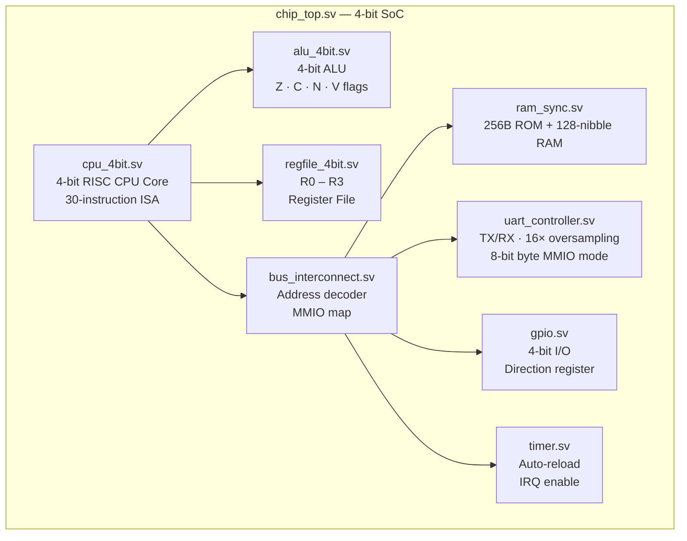

[← Back to Home](../index.md)

# 🔧 ChipGPT — A 4-bit System-on-Chip in SystemVerilog

> **Prompt that started it all:** *"Create a chip in SystemVerilog, 4-bit, that can do UART communication."*

This project grew from a single line into a complete System-on-Chip — but not in one shot. It was built through a series of deliberate, iterative instructions where I set the direction at each step and Antigravity executed.

---

## 🧭 How I Guided the Project

The chip didn't emerge fully-formed. Each phase was a conscious decision on my part about what to build next, what to verify, and where to push harder:

- **Started simple, then expanded scope:** The first prompt was just "4-bit chip with UART". Once the UART and CPU skeleton were working, I pushed for more — GPIO, a timer, a bus interconnect, a proper memory map. I kept raising the bar.
- **Demanded real verification:** I explicitly asked for self-checking testbenches, not just "it compiles". I required every feature — TX serialization, RX oversampling, all 30 ISA instructions, flag logic, branch conditions — to have a PASS/FAIL result printed to stdout.
- **Asked for a working assembler:** Rather than hardcoding hex values, I asked for a proper Python assembler so firmware could be written in human-readable assembly. This led to two real firmware programs — a boot ROM with a UART echo loop, and a Fibonacci math demo.
- **Pushed for synthesis, not just simulation:** I wanted to see the actual gate-level netlist, not just a passing simulation. This triggered the full Yosys synthesis pipeline and the schematic export.
- **Tested it on real hardware:** I rebuilt the project on a Raspberry Pi and sent Antigravity the error messages when things broke. It had to adapt the codebase to be compatible with older versions of Icarus Verilog and Yosys on Debian — a real-world portability challenge.
- **Kept asking about visualization:** I specifically asked how to view waveforms and schematics in a GUI. This drove the addition of GTKWave/Surfer instructions and the `.dot → .svg` Graphviz conversion in the Makefile.
- **Closed the loop with CI/CD:** I asked for the project to be "ready for GitHub" — clean, reproducible, and automated. That produced the GitHub Actions workflow and the full setup guide.

Throughout all of this, **Antigravity handled the implementation** — writing SystemVerilog, testbenches, Makefiles, Python scripts, and CI YAML — while **I provided the vision, the requirements, and the quality bar.**

---

## 🏛️ Architecture



---

## 📋 Memory Map

| Address Range | Size | Peripheral |
|---|---|---|
| `0x00 – 0x7F` | 128 nibbles | Internal Scratchpad RAM |
| `0x80 – 0x88` | 9 nibbles | UART Controller (TX, RX, Status, Baud, Byte mode) |
| `0x90 – 0x92` | 3 nibbles | GPIO (Data out, Data in, Direction) |
| `0xA0 – 0xA4` | 5 nibbles | Timer (Counter, Control, Reload) |
| `0xF0` | 1 nibble | CPU Flags (V · N · C · Z) |

---

## 📐 Instruction Set (ISA)

The CPU executes a custom **30-instruction** ISA with 1- and 2-byte encodings:

| Category | Instructions |
|---|---|
| **Arithmetic** | `ADD`, `SUB`, `INC`, `DEC` |
| **Logic** | `AND`, `OR`, `XOR`, `NOT`, `SHL`, `SHR` |
| **Data Movement** | `MOV`, `LDI`, `LD`, `ST`, `LDR`, `STR` |
| **Control Flow** | `JMP`, `JZ`, `JNZ`, `JC`, `JNC`, `JN`, `JV`, `CALL`, `RET`, `HLT`, `NOP` |
| **UART** | `UART_TX`, `UART_RX`, `UART_ST` |

---

## ✅ Verification — 4 Self-Checking Testbenches

All testbenches run with **Icarus Verilog** and are fully self-checking (PASS/FAIL printed to stdout).

| Testbench | What's tested |
|---|---|
| `tb/tb_uart.sv` | 8-bit TX serialization, 16× oversampling RX, noise glitch rejection, framing errors, baud accuracy |
| `tb/tb_cpu.sv` | All 30 ISA instructions, flag updates, branch conditions, subroutine call/return |
| `tb/tb_chip_top.sv` | Full SoC boot sequence, UART banner output, full-duplex echo loop, GPIO updates |
| `tb/tb_math_demo.sv` | Fibonacci sequence computed in firmware running on the actual hardware |

```bash
make all      # build + run all 4 testbenches
make waves    # generate .vcd waveforms for GTKWave / Surfer
make lint     # Verilator static analysis
make synth    # Yosys synthesis
make schematics  # RTL + netlist schematics → .svg via Graphviz
```

---

## 🔬 Synthesis & Schematics

Antigravity debugged the Yosys synthesis pipeline (including a cross-platform fix for Debian/Raspberry Pi OS compatibility) and added automatic `.dot → .svg` conversion via Graphviz.

Four schematics are generated:

| File | Content |
|---|---|
| `synth/schematic_alu.svg` | 4-bit ALU — arithmetic, logic, flag generation |
| `synth/schematic_cpu.svg` | CPU datapath, register file, control unit |
| `synth/schematic_elaborated.svg` | Full SoC elaborated RTL block diagram |
| `synth/schematic_netlist.svg` | Synthesized gate-level netlist (`$_AND_`, `$_DFF_`, `$_MUX_`…) |

---

## 🛠️ Python Assembler

A custom **Python assembler** (`tools/asm.py`) converts `.asm` source files into `.hex` machine code for the boot ROM. Two firmware programs are included:

- **`firmware/boot_rom.asm`** — Boot banner printed over UART + interactive full-duplex echo loop
- **`firmware/math_demo.asm`** — Fibonacci sequence computed and streamed over UART

---

## 🔄 Cross-Platform Fixes

During development, the project was tested on both macOS and a **Raspberry Pi** running Debian. Antigravity identified and fixed two compatibility issues:

1. **Icarus Verilog 11.x (Debian)** — SystemVerilog array initializer syntax not supported → converted to compatible `for`-loop initialization
2. **Yosys on Debian** — `import chip_pkg::*` not recognized → replaced package imports with guarded `\`include` headers

---

## 🚀 CI/CD — GitHub Actions

A `.github/workflows/ci.yml` workflow automatically runs on every push:
- Assemble firmware
- Run all 4 testbenches
- Verilator lint check
- Yosys synthesis

---

## 📂 Repository

> **[github.com/MathisBonnard/chipGPT](https://github.com/MathisBonnard/chipGPT)**

---

[← Back to Home](../index.md) | [Next: Raspberry Pi SysAdmin →](./rpi-sysadmin.md)
