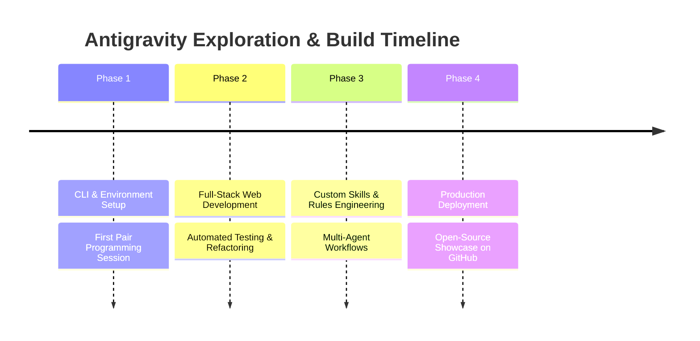

[← Back to Home](../index.md) | [← Back to Surfaces](./surfaces.md)

# 🏆 My Journey & Accomplishments with Google Antigravity

This page documents my hands-on experience, projects, workflows, and key milestones accomplished using Google Antigravity.

---

## 📈 Executive Summary

Working with Antigravity fundamentally accelerated my engineering velocity:

- ⚡ **Time-to-Prototype**: Reduced boilerplate and scaffolding time by ~80%.
- 🧩 **Agent Customization**: Built tailored skills, rules, and progressive disclosure runbooks.
- 🔄 **Parallel Autonomy**: Deployed subagents and background tasks to handle research and validation concurrently.
- 🎯 **High-Quality Code Standards**: Enforced zero-bloat vanilla styling and robust unit tests with automated review diffs.

---

## 🛠️ Key Projects & Case Studies



### 1. 🌐 GitHub Markdown Static Showcase (This Site!)
- **Goal**: Create a lightweight, elegant, and GitHub Pages-ready documentation website completely in Markdown to introduce Google Antigravity and my personal portfolio.
- **How Antigravity Helped**:
  - Structured modular documentation pages (`_config.yml`, `index.md`, and `docs/`).
  - Embedded Mermaid diagrams, tables, and quickstarts.
  - Formatted responsive, accessible layouts following strict design aesthetics.
- **Key Takeaways**: Instant GitHub Pages deployment with zero build step overhead.

---

### 2. ⚡ Autonomous Application Prototyping
- **Goal**: Rapidly scaffold modern web applications with clean architecture and responsive design.
- **How Antigravity Helped**:
  - Leveraged Antigravity's autonomous loop to write clean HTML/CSS/JS without unnecessary framework bloat.
  - Implemented real-time form validations, modal interfaces, and dynamic DOM rendering.
  - Iteratively refined typography, spacing, and micro-interactions.
- **Result**: Production-ready, accessible web interfaces created in minutes rather than days.

---

### 3. 🤖 Multi-Agent Orchestration & Subagent Delegation
- **Goal**: Perform comprehensive codebase audits and multi-file refactoring without bottlenecking the main conversation thread.
- **Techniques Used**:
  - **`research` Subagent**: Delegated broad codebase surveys, documentation fetching, and external API research.
  - **`self` Subagents**: Branched workspace explorations to test experimental architectural changes safely.
  - **Background Schedulers**: Set up asynchronous timers and task monitors using `schedule` to track long-running jobs.

---

### 4. 📐 Custom Rules & Declarative Skills Engineering
- **Goal**: Codify development guidelines so the agent consistently follows strict team standards.
- **Customizations Created**:
  - **Project Rules (`GEMINI.md` / `AGENTS.md`)**: Enforced clean code practices, banned anti-patterns, and defined file hierarchy conventions.
  - **Custom Skills (`skills/<name>/SKILL.md`)**: Designed step-by-step runbooks for API integrations and release deployment procedures.
  - **Progressive Disclosure**: Configured dynamic triggers so detailed guides are only loaded when relevant.

---

## 💡 Key Learnings & Developer Tips

> [!TIP]
> **1. Treat the Agent as a Senior Pair Programmer**  
> Clearly specify your intent and constraints up front. Use `/plan` for complex multi-step refactors to review the roadmap before writing code.

> [!NOTE]
> **2. Exploit Progressive Disclosure**  
> Organize custom runbooks into discrete skills. The agent will discover their high-level summaries and selectively activate full instructions only when required, preserving model context.

> [!IMPORTANT]
> **3. Leverage Sandboxed CLI Tools**  
> Don't manually copy-paste terminal outputs into chat. Let `agy` run tests and builds directly in the sandbox to detect and auto-fix diagnostics instantly.

---

## 📝 Add Your Own Projects

Feel free to expand this showcase by adding your own custom project entries below:

```markdown
### 🚀 [Project Name]
- **Repository**: [github.com/your-username/project-name](https://github.com)
- **Description**: Brief explanation of what you built.
- **Antigravity Features Used**: (e.g., Tab autocomplete, Cmd+I refactoring, Subagents)
- **Results / Impact**: Key metrics or accomplishments.
```

---

[← Back to Surfaces](./surfaces.md) | [Next: Customizations & Skills Guide →](./customizations-guide.md)
