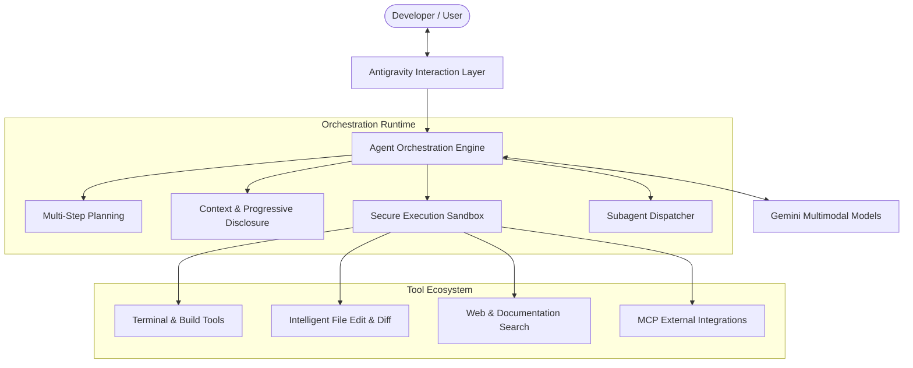

[← Back to Home](../index.md)

# 💡 What is Google Antigravity?

**Google Antigravity (AGY)** represents a fundamental paradigm shift in AI-assisted software development. Created by Google DeepMind, Antigravity moves beyond simple code autocompletion and conversational chatbots into the realm of **fully autonomous, multimodal pair-programming agents**.

---

## 🏛️ Core Architectural Pillars

### 1. Unified Intelligence across Modalities
Antigravity is powered by Google's flagship Gemini models, providing:
- **Long Context Processing**: Ingesting entire codebases, logs, and documentation effortlessly.
- **Multimodal Understanding**: Direct reasoning over images, mockups, UI screenshots, and diagrams.
- **Strong Reasoning & Tool Use**: High-precision tool execution, self-correction, and diagnostic debugging.

### 2. Multi-Step Autonomy with Guardrails
Instead of expecting the developer to manually stitch snippets together, Antigravity:
- **Analyzes Requirements**: Breaks complex tasks into coherent, verifiable sub-tasks.
- **Executes Proactively**: Reads files, implements targeted edits, and validates results with automated builds or tests.
- **Safety Policies & Sandboxing**: Configurable permission levels (`always-proceed`, `request-review`, `strict`, `proceed-in-sandbox`) protect sensitive directories and network resources.

### 3. Progressive Disclosure Architecture
Traditional AI tools often clutter the model's context window with bulky documentation and runbooks. Antigravity employs **Progressive Disclosure**:
- Only names and short descriptions of available Skills and Rules are initially indexed.
- Detailed runbooks, specialized scripts, and deep guides are lazy-loaded on-demand when the agent or developer selects them.
- Prevents context degradation and maximizes token efficiency.

---

## 🔄 Interaction Modalities

Antigravity adapts to how you work across three tiers of interaction:

| Modality | Shortcut / Entrypoint | Best For | Behavior |
| :--- | :--- | :--- | :--- |
| **Passive** | <kbd>Tab</kbd> / Supercomplete | Fast writing, boilerplate | Anticipates next lines, multi-line diffs, and navigation points. |
| **Instructive** | <kbd>⌘</kbd>+<kbd>I</kbd> (Mac) / <kbd>Ctrl</kbd>+<kbd>I</kbd> | Refactoring, docstrings | Selects a block of code and applies precise, localized instructions. |
| **Collaborative** | Sidebar / Chat Canvas | Full features, debugging | Autonomous multi-step execution with file system and terminal tools. |

---

## 🛡️ Enterprise-Grade Security & Sandboxing

Antigravity provides granular controls at both the **global** and **project-level**:

- **Terminal Sandboxing**: Isolates command execution in controlled containers.
- **File Access Policies**: Explicit allow/deny lists for non-workspace directories.
- **Network Boundaries**: Domain allowlists for browser navigation and external API calls.
- **Human-in-the-Loop Reviews**: Interactive diff inspection before changes are permanently committed.

---

[← Back to Home](../index.md) | [Next: Ecosystem Surfaces & Tools →](./surfaces.md)
