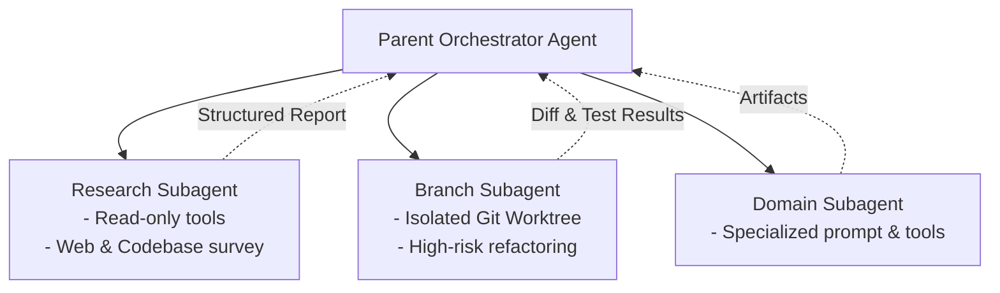
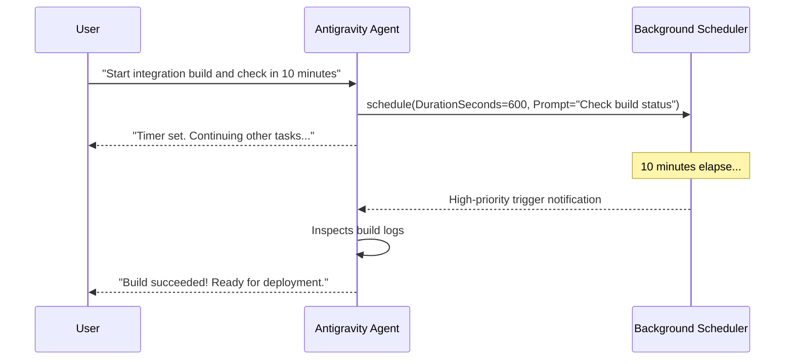

[← Back to Home](../index.md) | [← Back to Surfaces](./surfaces.md)

# 🤖 Subagent Orchestration & Background Scheduling

One of Google Antigravity's most powerful architectural advantages is its ability to **delegate work asynchronously** across dedicated subagents and scheduled background tasks.

---

## 👥 Subagent Topologies

Rather than keeping everything in a single, congested context window, Antigravity can dynamically instantiate child subagents:



### Standard Subagent Types:
1. **`research`**: A focused subagent equipped with read-only tools and web search. It surveys documentation, searches large codebases, and synthesizes answers without bloating the primary agent's token context.
2. **`self`**: Inherits the parent agent's configuration and tools to explore parallel solutions or branched workspaces.
3. **Custom Defined Subagents**: Dynamically declared at runtime via `define_subagent` with bespoke system prompts, capabilities, and tool groups.

---

## ⏱️ Background Task Scheduling

Antigravity natively includes a scheduler engine for both **delayed timers** and **recurring cron jobs**:



### Scheduling Modes:

#### 1. One-Shot Delayed Timers
- Set a timer with `DurationSeconds`.
- Configurable early-termination conditions (`never`, `any`, or a specific task ID).

#### 2. Recurring Cron Expressions
- Standard 5-field cron syntax (`*/15 * * * *` for every 15 minutes).
- Automatically triggers recurring codebase health checks, dependency vulnerability scans, or staging deployments.

---

## 💻 Programmatic Example (Tool Usage)

```json
{
  "name": "schedule",
  "args": {
    "CronExpression": "0 2 * * *",
    "Prompt": "Run full regression test suite and compile daily status report.",
    "MaxIterations": 30
  }
}
```

---

[← Back to Surfaces](./surfaces.md) | [Back to Home](../index.md)
