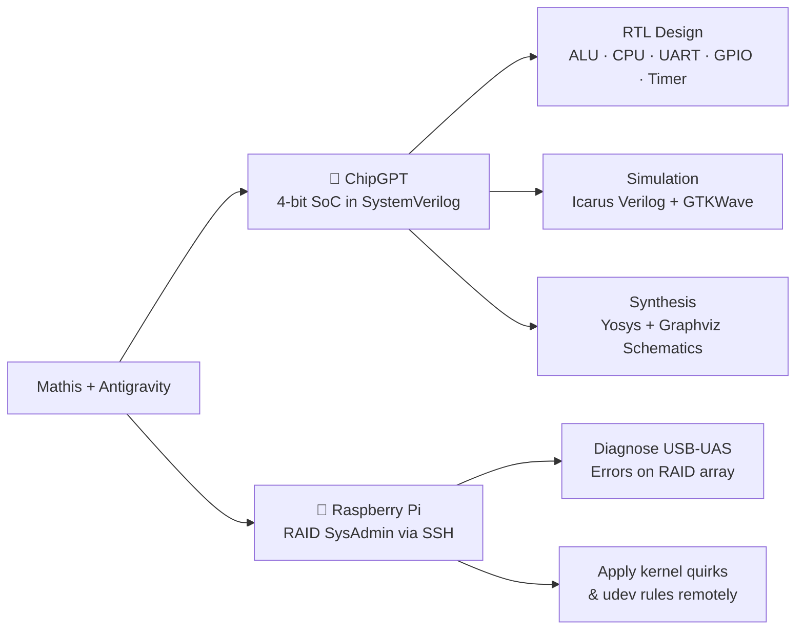

# 🤖 Mathis × Google Antigravity

> A personal showcase of real engineering projects built in collaboration with **Google Antigravity** — an AI-first agentic coding assistant by Google DeepMind.

---

## 🧭 What's in this showcase?

This site documents **real projects** I built with Antigravity acting as an autonomous pair programmer — writing code, running tests, fixing bugs, SSHing into servers, and pushing to GitHub, all from natural language instructions.

| Project | Description | Status |
| :--- | :--- | :--- |
| 🔧 **[ChipGPT — 4-bit SoC](./docs/chipgpt.md)** | Full RISC CPU with UART, GPIO, Timer & RAM — designed, verified & synthesized in SystemVerilog | ✅ Done |
| 🍓 **[Raspberry Pi SysAdmin](./docs/rpi-sysadmin.md)** | Remote RAID debugging & USB quirk fix via SSH | ✅ Done |
| 💡 **[About Antigravity](./docs/about-antigravity.md)** | What Antigravity is and how it works as an agentic assistant | 📖 Reference |

---

## ⚡ Project Highlights

---

## 🔧 Project 1 — ChipGPT: A 4-bit SoC in SystemVerilog

Starting from a single sentence — *"Create a chip in SystemVerilog, 4-bit, with UART communication"* — Antigravity autonomously designed and implemented a **complete System-on-Chip** from scratch.

### What was built:
- **4-bit RISC CPU** with a custom 30-instruction ISA (arithmetic, logic, branches, subroutine calls)
- **4-bit ALU** with full flag support (Zero, Carry, Negative, Overflow)
- **Register file** (R0–R3)
- **UART controller** (TX + RX, 16× oversampling, 8-bit byte mode via MMIO)
- **GPIO peripheral** (4-bit in/out with direction register)
- **Timer** with auto-reload and IRQ enable
- **Bus interconnect** with full memory map (ROM / RAM / MMIO)
- **Python assembler** for the custom ISA
- **4 self-checking testbenches** (UART, CPU, SoC integration, Fibonacci math demo)
- **Yosys synthesis** with Graphviz schematic export (elaborated RTL + gate-level netlist)
- **GitHub Actions CI** — automated build, test, lint and synth on every push

👉 [Full write-up →](./docs/chipgpt.md)

---

## 🍓 Project 2 — Raspberry Pi RAID SysAdmin

Antigravity SSHed directly into my Raspberry Pi at `192.168.1.30`, diagnosed a RAID array that kept sending email alerts, and applied a kernel-level USB quirk fix — all autonomously.

### What happened:
- RAID array appeared healthy (`[UU]`) but kept triggering failure alerts
- Root cause identified: JMicron JMS578 USB adapters (`152d:0578`) running on the UAS driver, causing repeated command errors
- Applied `usb-storage.quirks` fix in `/boot/cmdline.txt` and created a persistent `udev` rule
- Rebuilt the degraded RAID array after a clean reboot

👉 [Full write-up →](./docs/rpi-sysadmin.md)

---

## 💡 What is Google Antigravity?

**Google Antigravity** is not a chatbot. It's an **autonomous agentic coding assistant** that can:
- Write, run, and debug code directly in your terminal
- SSH into remote machines and fix live systems
- Spawn parallel sub-agents for research and validation
- Commit and push to GitHub

👉 [Learn more →](./docs/about-antigravity.md)

---

  Built with ❤️ and <b>Google Antigravity</b>. Hosted on <b>GitHub Pages</b>.

