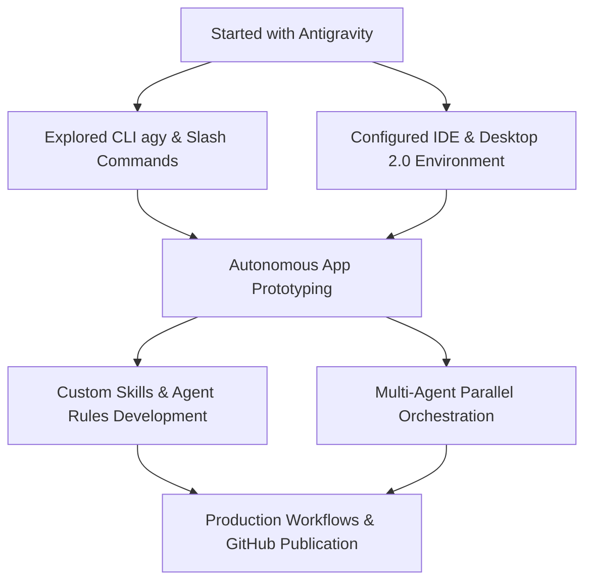

# 🚀 Welcome to Google Antigravity Showcase

> **Google Antigravity (AGY)** is Google DeepMind's next-generation, AI-first agentic coding platform. It bridges the gap between passive autocomplete and truly autonomous, collaborative software engineering.

[](#)
[](#)
[](#)
[](#)

---

## 🧭 Site Navigation

Explore the complete guide and documentation:

| Section | Description | Quick Link |
| :--- | :--- | :--- |
| **💡 Antigravity Overview** | Core pillars, architecture & Gemini foundation | [Explore Overview](./docs/overview.md) |
| **🛠️ Ecosystem & Surfaces** | Desktop 2.0, IDE, CLI (`agy`), and Python SDK | [View Surfaces](./docs/surfaces.md) |
| **🏆 What I've Done So Far** | Real-world projects, experiments, workflows & milestones | [View My Journey](./docs/my-journey.md) |
| **⚙️ Customizations & Skills** | Extending Antigravity via Skills, Rules (`AGENTS.md`), and Plugins | [Read Customizations](./docs/customizations-guide.md) |
| **🐍 Python SDK Recipes** | Real-world code recipes, thought streaming & tool interception | [Explore SDK Recipes](./docs/sdk-examples.md) |
| **🔌 MCP Integration** | Connect to PostgreSQL, GitHub APIs & internal tools | [View MCP Showcase](./docs/mcp-showcase.md) |
| **🤖 Subagents & Scheduling** | Multi-agent topologies and background cron jobs | [View Subagents & Tasks](./docs/subagents-and-scheduling.md) |
| **🏁 Getting Started** | Quickstart installation, setup, and first agent launch | [Start Here](./docs/getting-started.md) |
| **❓ FAQ** | Frequently asked questions, security, and best practices | [Read FAQ](./docs/faq.md) |

---

## ⚡ What is Google Antigravity?

Google Antigravity is not just another chatbot in an IDE; it is a **full-stack agentic development runtime** engineered to perform multi-step planning, iterative execution, test validation, and tool orchestration.

```
+-------------------------------------------------------------------------+
|                         GOOGLE ANTIGRAVITY                              |
+--------------------+---------------------+--------------------+---------+
|  Antigravity 2.0   |   Antigravity IDE   |    CLI (`agy`)     | Python  |
|  (Desktop App)     |   (In-Editor AI)    |    (Terminal)      |   SDK   |
+--------------------+---------------------+--------------------+---------+
|                  Agent Core & Orchestration Engine                     |
|           - Progressive Disclosure   - Subagent Hierarchies             |
|           - Secure Sandbox Runtime   - Custom Skills & MCP Tools        |
+-------------------------------------------------------------------------+
|                  Gemini Multimodal Foundation Models                    |
+-------------------------------------------------------------------------+
```

### Key Pillars:
1. **Three Interaction Modalities**:
   - **Passive** (*Tab Supercomplete*): Next-intent code synthesis and predictive navigation.
   - **Instructive** (*Cmd+I / Inline*): Targeted, localized code refactoring and doc generation.
   - **Collaborative** (*Agent Mode*): Multi-turn autonomous pair programming with terminal, browser, and file system capabilities.
2. **True Multitasking & Subagents**:
   - Background task scheduling (delayed timers, recurring crons).
   - Subagents (`research`, `self`, custom domain agents) for parallel exploration.
3. **Extensibility & Context Control**:
   - **Progressive Disclosure**: Keeps context clean by lazy-loading skill instructions only when needed.
   - **Model Context Protocol (MCP)**: Native connectivity to external APIs, databases, and services.

---

## 🌟 Highlights: What I've Done So Far

Here is a snapshot of my work, experiments, and accomplishments using Google Antigravity:



### 1. 🏗️ Autonomous Project Scaffolding & Web Applications
Leveraged Antigravity's agentic loop to scaffold, design, and implement responsive, high-performance web applications using vanilla web technologies, Next.js, and modern CSS architectures with zero boilerplate friction.

### 2. 🧩 Custom Skills & Rules Engineering
Authored custom `SKILL.md` runbooks and hierarchical `AGENTS.md` / `GEMINI.md` project rules to enforce codebase standards, security policies, and team workflows.

### 3. 🤖 Subagent & Background Automation
Harnessed the `define_subagent` and `schedule` facilities to run automated background builds, test suites, and parallel research tasks while continuing interactive development.

### 4. 🐍 Python SDK Integration
Experimented with `google-antigravity` programmatic agent orchestration to automate codebase navigation, test generation, and streaming tool executions.

👉 **[Read the complete breakdown and project case studies in What I've Built & Learned](./docs/my-journey.md)**

---

## 📊 Feature Comparison: Antigravity vs Traditional AI Assistants

| Feature | Traditional AI Copilots | Google Antigravity |
| :--- | :--- | :--- |
| **Execution** | Code completion / Single prompt | Multi-step agentic planning & tool calling |
| **Terminal Integration** | Read-only copy-paste snippets | Direct, sandboxed execution with live feedback |
| **Subagents** | None (Single thread) | Dynamic spawning of parallel worker agents |
| **Customizations** | Basic system prompts | Declarative Skills, Rules, MCP, and Hooks |
| **Background Execution** | Blocks user interface | Asynchronous tasks with reactive notifications |
| **Desktop Surfaces** | Plugin only | Dedicated Desktop 2.0 App + IDE + CLI + SDK |

---

## 🚀 Quick Links & Resources

- 📖 [Official Antigravity Documentation](https://antigravity.google/docs)
- 📦 [Antigravity Python SDK (GitHub)](https://github.com/google-antigravity/antigravity-sdk-python)
- 📁 [View Project Repository](https://github.com)

---

<div align="center">
  <sub>Built with ❤️ and powered by <b>Google Antigravity</b>. Hosted seamlessly on <b>GitHub Pages</b>.</sub>
</div>
